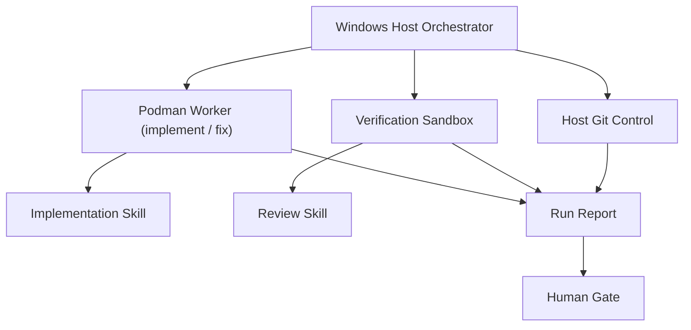
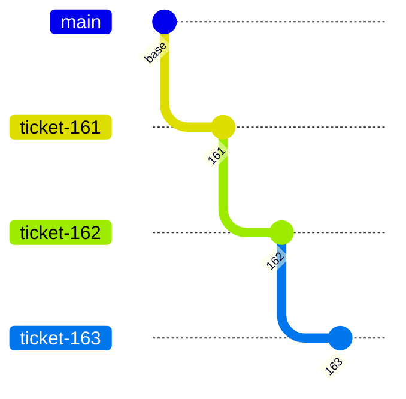
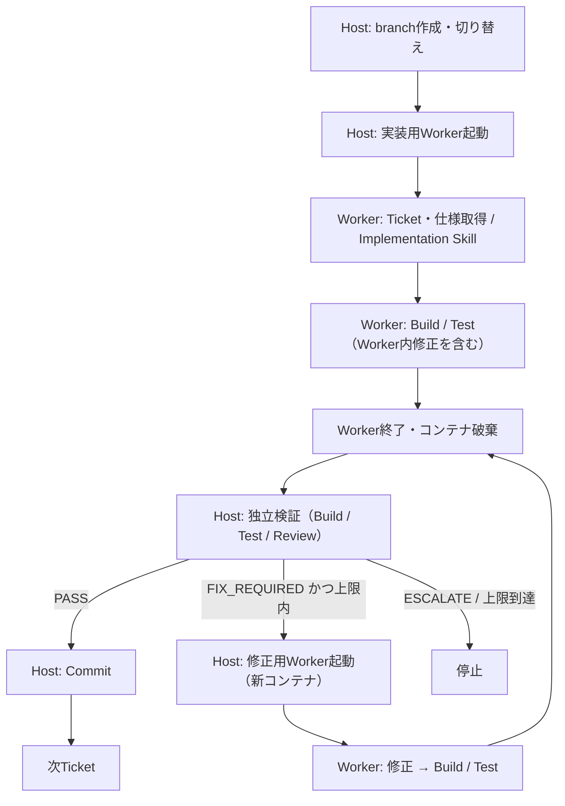
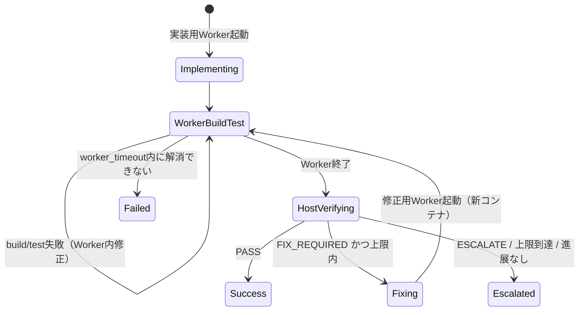

# 連続API実装オーケストレーション仕様書

| 項目 | 内容 |
|---|---|
| 文書状態 | Draft |
| 対象 | Redmine管理下の複数API実装チケット |
| 実行環境 | Windowsホスト + Podman Sandbox + Claude Code |
| 主要技術 | C# / .NET 10 / ASP.NET Core / Entity Framework Core |
| 基本方式 | 直列実行・積み上げブランチ・全件完了後のHuman Gate |

---

## 1. 目的

Redmineで管理される複数のAPI実装チケットを、指定順に連続して実装・検証・レビューする。

各チケットの完了ごとに人間の確認を要求せず、指定された全チケットが完了した時点で1回だけ計画上のHuman Gateを設ける。これにより、人間の逐次操作を減らしつつ、変更をローカル環境内に閉じた状態で安全に自律実行する。

既存のImplementation SkillおよびReview Skillは、API仕様の探索・実装・レビューに関する正本として再利用する。本オーケストレーターは、それらの業務ロジックやレビュー基準を再実装しない。

---

## 2. 適用範囲

### 2.1 対象

- Redmine Ticketに対応するAPI実装
- C# / .NET 10 / ASP.NET Core / Entity Framework Coreの変更
- 既存テストの実行および必要なテスト追加
- build時に生成される`controller.json`の更新
- 既存Implementation SkillおよびReview Skillの呼び出し
- Windowsホストによるローカルbranch作成およびcommit
- 全チケット完了後のHuman Gate用レポート生成

### 2.2 対象外

- remoteへのpush
- PRの作成・更新
- merge
- Redmine Ticketの状態変更やコメント投稿
- 自動デプロイ
- DB migrationの本番適用
- 独立チケットの並列実行
- 既存Skill自体の変更

---

## 3. 要求レベル

本書では以下の表現を使用する。

| 表現 | 意味 |
|---|---|
| MUST | 必須。満たさない場合は仕様違反 |
| MUST NOT | 禁止 |
| SHOULD | 原則必須。例外には理由の記録が必要 |
| MAY | 任意 |

---

## 4. 前提条件

### 4.1 技術スタック

- C#
- .NET 10
- ASP.NET Core
- Entity Framework Core
- Git
- Redmine
- Claude Code
- Podman
- Windows

### 4.2 管理単位

原則として以下の対応関係を使用する。

```text
1 API = 1 Redmine Ticket = 1 Git Branch
```

例：

| Ticket | 実装対象 |
|---|---|
| 161 | API A |
| 162 | API B |
| 163 | API C |

複数Ticketが同一Controller、Service、Entity、テスト、または`controller.json`を変更することを許容する。

### 4.3 既存Skillの前提

Implementation Skillは概ね以下の責務を持つ。

1. branch名からRedmine Ticket番号を特定する
2. Redmine Ticketを取得する
3. 対象Endpointを特定する
4. 仕様参照領域を検索する
5. API仕様を確定する
6. APIを実装する

Review Skillは、実装差分を既存基準でレビューする。

オーケストレーターは上記ロジックを複製しない。既存Skillは、本書のGit境界および責務分離へ対応済みであることを前提とする。

---

## 5. 設計原則

1. Claude Codeには必要最小限の権限のみを与える。
2. Claude CodeはPodman Sandbox内で実行する。
3. Read Onlyの照会を含むすべてのGit処理はWindowsホストだけが実行する。
4. Implementation SkillおよびReview Skillは既存実装を再利用する。
5. Ticketは入力された順序どおりに直列処理する。
6. 前Ticketの完成状態を次Ticketへ継承する。
7. 各Ticketでimplementation、build、test、reviewを完結させる。
8. Ticket間に計画上のHuman Gateを設けない。
9. 全Ticket完了後に1回だけ計画上のHuman Gateを設ける。
10. push、PR作成、mergeは人間が実行する。
11. 一意に確定できない仕様をClaude Codeが推測で補完しない。
12. 破壊的操作、権限昇格、セキュリティ境界の回避を許可しない。
13. Workerの自己申告だけで成功と判定せず、ホスト側でも結果を検証する。
14. 失敗時の変更は自動破棄せず、調査可能な状態で保持する。

---

## 6. 全体アーキテクチャ



### 6.1 Windows Host Orchestrator

- Ticket Queueの保持
- 専用worktreeの準備
- branch作成および切り替え
- Podman Workerの起動・停止
- Worker入力の生成
- Worker結果の検証
- 固定した変更内容に対する検証用Sandboxの起動と結果の直接収集
- 修正反復の計数と修正用Workerの起動
- 差分検査
- commit
- 次Ticketへの遷移
- 全体停止制御
- Human Gate用レポート生成

### 6.2 Podman Worker

- Claude Codeの実行
- Implementation Skillの実行（実装モード）
- buildおよびtest
- ホスト検証結果に基づく許可範囲内の修正（修正モード）
- 構造化結果の出力

Review Skillは実装用・修正用Workerでは実行しない。Review Skillは18.1節でホストが起動する検証用Sandboxだけで実行する。

### 6.3 Human

- 累積差分とTicket単位commitの最終確認
- 必要な手動修正
- push
- PR作成
- merge判断

---

## 7. 責務分離

| 処理 | Windows Host | Podman / Claude Code | Human |
|---|:---:|:---:|:---:|
| Ticket Queue管理 | ○ | － | 入力 |
| branch作成・切り替え | ○ | × | － |
| Ticket・仕様探索 | － | ○ | 必要時回答 |
| API実装 | － | ○ | 最終確認 |
| build / test | 起動・結果検証 | ○ | 最終確認 |
| Review Skill | 起動・結果収集 | 検証用Sandboxのみ | 最終確認 |
| 自律修正 | 反復計数・修正用Worker起動 | ○ | － |
| commit | ○ | × | 確認 |
| push / PR / merge | × | × | ○ |
| 停止・エスカレーション | ○ | 理由出力 | 判断 |

---

## 8. セキュリティ境界

### 8.1 Sandbox要件

Podman Workerは、起動ごとに新しい一時コンテナとして起動する。Ticketの初回実装と15章の各修正反復はそれぞれ別の起動であり、停止したコンテナの再開・再利用は行わない。

Workerは以下を満たさなければならない。

- 非rootユーザーで実行する
- `--privileged`を使用しない
- Linux capabilitiesを原則すべて削除する
- `no-new-privileges`を有効にする
- Podman socket、Docker socket、Windowsホストの管理用socketを公開しない
- Windowsユーザープロファイル全体をmountしない
- SSH鍵、Git認証情報、ブラウザー資格情報をmountしない
- 不要なデバイスを公開しない
- CPU、メモリ、プロセス数、実行時間に上限を設ける
- Worker終了後にコンテナを破棄する。次の起動は同じ専用worktreeを再mountした新しいコンテナで行う

### 8.2 Mount

| Container path | 権限 | 内容 |
|---|---|---|
| `/workspace` | Read / Write | 専用worktreeのソースコード |
| `/baseline` | Read Only | 当該Ticketの`parentSha`時点のソースsnapshot |
| `/reference` | Read Only | 仕様書・参照資料 |
| `/run/input` | Read Only | Ticket、branch、実行設定 |
| `/run/output` | Read / Write | Worker結果、ログ、レビュー結果 |
| `/tmp` | Read / Write | 一時ファイル |

Read Onlyはプロンプトではなく、PodmanおよびOSのmount権限で保証する。

通常の開発checkoutを直接mountしてはならない。Orchestratorが作成した専用worktreeだけを`/workspace`へ公開する。

`.git`ファイル、`.git`directory、Git index、ref、hook、configなどのGit metadataはWorkerへ公開しない。bind mountの都合でworktree内の`.git`が見える場合は、コンテナ側で空fileまたは空directoryによりmaskする。

`/baseline`はWindowsホストが`parentSha`から生成する。Review Skillは`/baseline`と`/workspace`を比較し、Worker内でGitを実行しない。

### 8.3 Network

Network accessはdeny-by-defaultを原則とし、必要な宛先だけを許可する。

- Redmine
- NuGet package source
- repository固有のbuild・testに必要な内部サービス
- その他、事前承認された仕様参照先

Git remote、任意の外部サイト、不要なクラウドmetadata endpointへの接続は許可しない。

### 8.4 Secret

- Redmine tokenやprivate package sourceの資格情報はTicket実行時だけ注入する。
- Secretは環境変数、Podman secret、または同等の一時的な手段で渡す。
- Secretをrepository、Worker結果、ログ、プロンプト履歴へ書き込まない。
- ログ出力前にtoken、Authorization header、接続文字列をマスクする。
- Git remote用資格情報はWorkerへ渡さない。

### 8.5 書き込み権限の限界

API実装にはソース領域への書き込み権限が必要であるため、Workerによるファイル削除をOS権限だけで完全には防止できない。

このリスクは以下で制限する。

1. 専用worktreeに隔離する
2. remote資格情報を与えない
3. Claude Codeのdeny ruleで破壊的コマンドを拒否する
4. commit前にホストが削除数・変更範囲を検査する
5. 異常な大量削除を検出した場合はcommitせず停止する
6. 失敗時にworktreeを保持し、基点commitから復旧可能にする

---

## 9. Git境界

### 9.1 基本規則

Read Onlyの照会を含むすべてのGit CLI実行は、Windows Host Orchestratorだけが行う。Podman WorkerはGit binaryおよびGit metadataへアクセスしてはならない。

branch名、Ticket番号、`parentSha`、変更前snapshotなど、Skillが必要とする情報はOrchestratorが`/run/input`および`/baseline`へ渡す。

以下を含むGit commandはPodman Workerから実行してはならない。

- `git status`
- `git diff`
- `git log`
- `git show`
- `git rev-parse`
- `git add`
- `git commit`
- `git switch`
- `git checkout`
- `git branch`
- `git merge`
- `git rebase`
- `git cherry-pick`
- `git reset`
- `git clean`
- `git stash`
- `git tag`
- `git fetch`
- `git pull`
- `git push`
- Git config、hook、ref、indexの変更

### 9.2 既存Skillの前提

既存のImplementation SkillおよびReview Skillは、以下へ対応済みであることを前提とする。

- Podman Worker内からbranch、index、commit、ref、remoteを変更しない
- Podman Worker内からRead Onlyを含むGit CLIを実行しない
- commit、push、PR作成、mergeを行わない
- Orchestratorから渡されたbranch名、Ticket番号、基点commit、`/baseline`を利用できる
- 実装・build・test・review・自律修正だけを担当する
- PASS / FAIL / ESCALATEを機械判定可能な形式で返す

Orchestratorは既存Skillを変更せず、その入出力契約に従って呼び出す。

### 9.3 Host側の禁止事項

Orchestratorも以下を自動実行してはならない。

- `git push`および`git push --force`
- `git reset --hard`
- `git clean -fd`および同等の削除操作
- 既存branchの強制削除
- 未commit変更の破棄
- remote branchの作成・削除
- 自動merge

---

## 10. Orchestrator

### 10.1 実行場所

OrchestratorはWindowsホスト上で実行する。Podman内で実行してはならない。

Git Bashがチーム標準である場合、初期実装はBashを第一候補とする。

```text
orchestrate.sh
```

Windows path、空白、改行コード、Podman bind mountの変換差異を考慮し、pathは常に正規化・引用する。Git Bashの自動path変換に依存した実装にしない。

### 10.2 入力

最小形式：

```bash
./orchestrate.sh 161 162 163
```

推奨形式：

```bash
./orchestrate.sh \
  --base <base-branch> \
  --config orchestrator.yaml \
  161 162 163
```

Ticket番号の入力順には意味がある。Orchestratorは並べ替えてはならない。

### 10.3 設定項目

repository固有値をscriptへ直接埋め込まず、設定ファイルまたは明示的な引数で与える。

| 項目 | 必須 | 内容 |
|---|:---:|---|
| `base_branch` | ○ | 最初のTicket branchの基点 |
| `branch_rule` | ○ | 既存branch命名規則へのマッピング |
| `build_command` | ○ | repository固有のbuild command |
| `test_command` | ○ | repositoryのAPI回帰テスト一式を実行するcommand。テストなしの場合も明示 |
| `controller_json_path` | ○ | 生成物の期待path |
| `max_fix_iterations` | ○ | 修正用Workerの起動回数上限。ホストだけが計数する |
| `worker_timeout` | ○ | Ticket単位の上限時間 |
| `allowed_write_paths` | ○ | Ticketで変更を許可するpath範囲 |
| `max_deleted_files` | ○ | 自動停止する削除ファイル数の閾値 |
| `artifact_directory` | ○ | repository外の実行結果保存先 |

Ticket番号、branch名、command、pathは、shellへ渡す前に許可形式を検証する。文字列を未検証のまま`eval`へ渡してはならない。

### 10.4 実行識別子

実行ごとに一意な`run_id`を発行する。

例：

```text
20260910T071500Z-161-163-a1b2c3
```

ログ、Worker結果、基点commit、Ticket別結果は`run_id`で関連付ける。

---

## 11. Branch戦略

### 11.1 積み上げ方式

Ticketは独立した基点から並列実装せず、前Ticketの完成branchから次Ticketのbranchを作成する。



- Ticket 162はTicket 161の実装を含む。
- Ticket 163はTicket 161および162の実装を含む。
- 同一ファイルへの変更は、この順序で累積する。

### 11.2 専用worktree

Orchestratorは通常の開発checkoutと分離した専用worktreeを作成し、その中だけで自動処理する。

- 開始時の`base_branch`と`base_sha`を記録する。
- 既存の開発checkoutに未commit変更があっても、それを自動処理へ混入させない。
- 既存branchと同名のbranchがある場合は上書き・再利用せず停止する。
- 実行終了または失敗後も、自動削除せずHuman Gateまで保持する。

### 11.3 Branch命名

既存repositoryのbranch命名規則を利用し、Orchestrator独自の規則を導入しない。

branch名は以下を満たす必要がある。

- 対応するRedmine Ticket番号を一意に抽出できる
- 別のTicket番号と誤認しない
- Implementation Skillが解釈できる
- 入力値から決定的に生成できる

生成後、Orchestratorはbranch名からTicket番号を逆算し、入力Ticketと一致することを検証する。

### 11.4 PR作成時の注意

本方式はstacked branchである。Human Gate後にTicket単位のPRを作る場合、原則として次のbaseを使用する。

| PR | base | head |
|---|---|---|
| Ticket 161 | 元のbase branch | Ticket 161 branch |
| Ticket 162 | Ticket 161 branch | Ticket 162 branch |
| Ticket 163 | Ticket 162 branch | Ticket 163 branch |

前段PRをsquash mergeまたはrebase mergeした場合、後続branchの履歴調整が必要になる可能性がある。この操作はHuman Gate後に人間が行う。

---

## 12. `controller.json`

Swagger/OpenAPI用の`controller.json`はbuild時に自動生成され、Git管理対象とする。

```text
API実装
  ↓
build
  ↓
controller.json生成・更新
  ↓
検証
  ↓
host commit対象
```

要件：

- Claude Codeが`controller.json`を直接編集することを前提としない。
- 18.1節の検証用一時コピーで、既存の`controller.json`を除いた状態からbuildし、期待pathへ新しく生成されることを確認する。元のworktreeのファイルは削除しない。
- 新しく生成された内容とcommit候補の`controller.json`が一致することをホストが確認する。ファイルの存在や更新時刻だけでは生成成功と判定しない。
- 生成物を含めてtestおよびreviewを行う。
- 環境差による並び順、時刻、絶対path、改行コードだけの不要差分を防止する。
- 想定外の大量変更または対象APIと無関係な変更が発生した場合は停止する。
- 各Ticketのcommitへ、そのTicketに対応する生成差分を含める。
- API内部処理のみの変更など、生成結果が親commitと同一になる場合は生成差分なしを正常とする。再生成と内容一致の確認は省略しない。

---

## 13. 開始前検証

Orchestratorは変更を開始する前に、以下を順に検証する。

### 13.1 Repository

- 対象がGit repositoryである
- `base_branch`が存在する
- `base_sha`を取得できる
- 専用worktreeを安全に作成できる
- 対象branch名が既存branchと衝突しない
- repository固有の指示ファイルとbuild手順を読み取れる

### 13.2 入力

- Ticketが1件以上指定されている
- Ticket番号の形式が妥当である
- Ticket番号に重複がない
- branch名との相互変換が一意である
- Ticket順序が明示されている

Ticketの存在確認をホストから実施できない場合、各Workerの最初の処理として確認する。存在しないTicketが見つかった時点で全体を停止する。

### 13.3 実行環境

- Podman engineが利用可能である
- 指定Worker imageをdigestで特定できる
- Claude Code Workerが起動可能である
- 必要な.NET SDK versionが一致する
- build/testに必要な依存先へ接続できる
- `/reference`をRead Onlyでmountできる
- `/baseline`をRead Onlyでmountできる
- Git metadataをWorkerからmaskできる
- 出力領域へ書き込める
- timeoutおよびresource limitが設定されている

### 13.4 Skill

- Implementation Skillが利用可能である
- Review Skillが利用可能である
- Skill versionまたはchecksumを記録できる
- Skillが必要とするbranch・Ticket・baseline情報を渡せる
- Skill出力からPASS / FAIL / ESCALATEを機械判定できる

1項目でも満たさない場合、Ticket branchを作成する前に停止する。

---

## 14. Ticket処理フロー

各Ticketを次の順序で処理する。



Review Skillは、Worker内ではなくホストが起動する独立検証（18.1節）だけで実行する。Worker内とホスト側で同じLLMレビューを二重に実行すると、結果の揺れにより判定が一致しないため、レビュー判定は常にホスト側の1回だけとする。

### 14.1 Host準備

1. 前Ticketの成功commitを親としてTicket branchを作成する。
2. branchを切り替える。
3. `ticket_id`、`branch_name`、`parent_sha`、設定値をWorker入力へ出力する。
4. Worker起動前のtree状態を記録する。
5. `mode = implement`で実装用Podman Workerを起動する。

### 14.2 Implementation

1. 入力Ticketとbranch名の対応を検証する。
2. Implementation Skillを起動する。
3. Redmine Ticketを取得する。
4. Endpointと仕様参照先を特定する。
5. 仕様を一意に確定する。
6. APIと必要なテストを実装する。

OrchestratorはAPI仕様を独自に組み立ててImplementation Skillへ渡さない。Ticket、branch、実行境界など、処理コンテキストだけを渡す。

### 14.3 Build

repository固有のbuild commandを優先する。

標準例：

```bash
dotnet build
```

要件：

- command、対象solution/project、configurationを設定で固定する。
- exit codeを記録する。
- stdout / stderrをログへ保存する。
- timeoutを適用する。
- build失敗時はWorker内で修正して再実行する。`worker_timeout`内に成功しない場合、Workerは`FAILED`で終了し、Orchestratorは停止する。
- 既存baselineにない新規warningを検出可能にすることを推奨する。

### 14.4 Test

repository固有のtest commandを優先する。

標準例：

```bash
dotnet test --no-build
```

要件：

- 対象test projectと実行範囲を設定で固定する。
- 各Ticketの最終検証では、当該Ticket・前Ticketまでの実装・既存APIを含むrepositoryのAPI回帰テスト一式を、累積コードに対して実行する。当該Ticketだけに絞ったテストで代用しない。
- exit code、成功数、失敗数、skip数を記録する。
- timeoutを適用する。
- test失敗時はWorker内で修正して再実行する。`worker_timeout`内に成功しない場合、Workerは`FAILED`で終了し、Orchestratorは停止する。
- テストが存在しない場合は`SKIPPED_NO_TESTS`とし、`PASS`と偽装しない。この場合、回帰が未検証であることをHuman Gate用レポートへ明記する。
- 外部サービス不足など、実装修正で解決すべきでない失敗はエスカレーションする。

### 14.5 Review

Workerが終了し、18.1節でホストが起動したbuildおよびtestが成功した後、同じ検証用Sandbox内で既存Review Skillを実行する。実装用・修正用Workerの内部ではReview Skillを実行しない。

- Review Skillの実行は1反復につきホスト起動の1回だけとする。
- Review Skillの判断基準をOrchestratorで再実装しない。
- Review対象は当該Ticketの親commitから現在のworktreeまでの差分とする。
- 前Ticketまでのcommit済み差分を当該Ticketの新規指摘対象として混入させない。
- Review結果は少なくとも`PASS`、`FIX_REQUIRED`、`ESCALATE`を識別可能にする。
- `FIX_REQUIRED`の場合、レビュー結果ファイルをそのまま次の修正用Workerへ`/run/input`経由で渡す。
- Review SkillがPR本文ドラフトを生成できる場合は成果物として保存するが、PRは作成しない。

---

## 15. Autonomous Fix Loop

### 15.1 基本動作

修正は次の2層で行い、Human Gateへは移行しない。

1. **Worker内修正**：1回のWorker起動の中で、build失敗およびtest失敗をClaude Codeが修正して再実行する。`worker_timeout`で上限を設ける。
2. **ホスト駆動修正**：18.1節の独立検証（build・test・Review Skill・生成物確認）で修正可能な問題が見つかった場合、Orchestratorが修正用Workerを新しいコンテナで起動する。

Review Skillの指摘に対する修正は、常にホスト駆動修正として行う。



### 15.2 自律修正可能範囲

- 実装に起因するコンパイルエラー
- 実装に起因するテスト失敗
- analyzer / formatterの指摘
- Review Skillによる明確な実装上の指摘
- 実装に起因するSwagger生成エラー
- 明確な既存規約違反
- 当該Ticketの仕様から一意に導ける不足実装

### 15.3 修正用Workerの起動

Orchestratorは修正用Workerを次の条件で起動する。

- 8章の要件を満たす新しい一時コンテナとして起動する。停止済みコンテナを再開しない。
- `/workspace`には当該Ticketの同じ専用worktreeを再mountする。18.1節の検証で修正が必要と判定された内容が、そのまま修正対象となる。
- `/baseline`は当該Ticketの`parentSha`時点のsnapshotのままとし、反復途中の状態へ差し替えない。
- `/run/input`へ次を渡す。
  - `mode = fix`
  - `iteration`（1から始まる修正反復番号）
  - 前回の独立検証でホストが収集したbuildログ、test結果、Review Skillの結果ファイル、生成物比較結果
  - 実装モードと同じ`ticket_id`、`branch_name`、`parent_sha`、設定値
- 修正用Workerは、渡された検証結果に基づいて修正し、Worker内でbuildおよびtestを実行してから終了する。Implementation Skillの仕様探索を最初からやり直さない。
- 修正用Workerも17章の結果契約に従い`worker-result.json`を出力する。
- Worker終了後、Orchestratorは18.1節の独立検証を新しいsnapshotで最初から再実行する。

### 15.4 反復制御

- `max_fix_iterations`を必須設定とし、修正用Workerの起動回数の上限とする。計数はOrchestratorだけが行い、Workerの自己申告を使用しない。
- 初期推奨値は3回とする。
- Worker内修正の回数は`max_fix_iterations`に含めず、`worker_timeout`で制限する。Workerは参考情報として回数を`worker-result.json`へ記録する。
- 修正後はbuild、test、review、生成物確認を省略せず、すべて18.1節の独立検証として再実行する。
- 修正用Worker終了後のsnapshotのtree SHAが修正前と同一の場合、進展なしとして上限前でも停止する。
- 同一原因の指摘が連続して再発し、差分または診断結果に有意な進展がない場合も上限前でも停止する。
- 上限到達時は`FIX_RETRY_EXCEEDED`としてエスカレーションする。
- 反復番号、修正概要、各反復の独立検証結果、snapshotのtree SHAをレポートへ記録する。

---

## 16. Escalation条件

以下の場合、Claude Codeは推測で処理を継続しない。Orchestratorは全体を停止し、後続Ticketを開始しない。

### 16.1 仕様

- API仕様を一意に確定できない
- Redmineと仕様書が矛盾する
- 複数仕様書が矛盾する
- 仕様の優先順位が不明である
- Acceptance Criteriaを満たす方法が複数あり、外部契約へ影響する

### 16.2 変更影響

- DB schema変更の影響が不明である
- 既存APIのbreaking changeが必要である
- 他Ticketの仕様変更が必要である
- 認証・認可・個人情報・機密情報に関する重要判断が必要である
- 公開API契約、データ移行、互換性に人間の判断が必要である
- 許可されたpath外の変更が必要である

### 16.3 実行

- Redmine、仕様領域、package sourceなど必須依存先へ接続できない
- build/test環境の不備で結果を確定できない
- Skillがセキュリティ境界と互換しない
- timeoutまたはresource limitへ到達した
- Review指摘を上限回数で解消できない
- Worker結果が欠損、不正、または自己矛盾している
- 異常な大量変更・大量削除を検出した
- Secret混入の疑いを検出した

停止理由には、推測ではなく確認できた事実、該当工程、再現command、関連ログの位置を含める。

---

## 17. Worker結果契約

Workerは標準出力だけに依存せず、`/run/output/worker-result.json`へ構造化結果を出力する。

この結果はWorkerの処理報告として扱う。build・testの最終判定には、18.1節でホストが独立に収集した結果を使用する。reviewはWorker内で実行しないため、Worker結果に含めない。

最小schema例：

```json
{
  "schemaVersion": 1,
  "runId": "20260910T071500Z-161-163-a1b2c3",
  "ticketId": 161,
  "branch": "<branch>",
  "parentSha": "<sha>",
  "mode": "implement",
  "iteration": 0,
  "outcome": "SUCCESS",
  "implementation": {
    "status": "PASS",
    "summary": "<summary>"
  },
  "build": {
    "status": "PASS",
    "exitCode": 0,
    "commandId": "default-build"
  },
  "test": {
    "status": "PASS",
    "exitCode": 0,
    "passed": 42,
    "failed": 0,
    "skipped": 1
  },
  "internalFixCount": 1,
  "blockingReason": null
}
```

`mode`は`implement`または`fix`とし、`iteration`は実装モードで`0`、修正モードでホストが渡した修正反復番号とする。ホストは入力した`mode`と`iteration`が結果と一致することを検証する。

`outcome`は以下のいずれかとする。

- `SUCCESS`
- `FAILED`
- `ESCALATED`
- `TIMED_OUT`

Workerのexit codeと`outcome`が矛盾する場合は失敗として扱う。

---

## 18. SUCCESS判定

Host Orchestratorは、以下をすべて満たした場合だけTicketを`SUCCESS`と判定する。

1. Worker processが正常終了した
2. `worker-result.json`が存在し、schema検証に成功した
3. 入力した`runId`、`ticketId`、`branch`、`parentSha`、`mode`、`iteration`と結果が一致した
4. 18.1節でホストが起動したbuildが`PASS`である
5. 同じ検証で累積コードのAPI回帰テストが`PASS`、または14.4節に従う明示的な`SKIPPED_NO_TESTS`である
6. 18.1節でホストが検証用Sandbox内で呼び出したReview Skillが`PASS`である
7. 修正用Workerの起動回数が`max_fix_iterations`以内である
8. host側のGit差分が存在する
9. 変更が許可path内に収まっている
10. 想定外の大量削除、submodule変更、Git metadata変更がない
11. Secretらしき情報が差分へ混入していない
12. 12章に従って`controller.json`を再生成し、commit候補との内容一致をホストが確認した
13. 検証済みsnapshotとcommit対象のtreeが一致し、commitが成功した

変更が0件の場合は自動的に成功とせず、`NO_CHANGES`として停止する。ただし、Ticketが既に満たされていることをReview Skillが明示し、人間が別途承認する運用は将来拡張とする。

### 18.1 ホスト起動の独立検証

Workerが成功を報告した後、Host Orchestratorは次を行う。build・test・reviewはすべてPodman内で実行し、Git操作はWindowsホストだけが行う。

1. Workerを停止し、19.2節の手順1〜5に従って変更を検査・stageする。stage済みtreeのSHAを記録し、その内容だけからGit metadataを含まない検証用snapshotを作成する。
2. snapshotの一時コピーを使う別の検証用Sandboxを起動する。検証用Sandboxにも8章のSandbox要件と9章のGit境界を適用する。元のworktreeの`bin`、`obj`などの未commit生成物は持ち込まない。
3. ホストが設定済みのbuild commandとtest commandを直接起動する。buildでは12章の再生成確認を行い、testでは14.4節のAPI回帰テスト一式を実行する。終了コードとstdout / stderrはホストが直接取得する。
4. 同じsnapshotと`/baseline`をRead Onlyで渡し、既存Review Skillを独立したClaude Code sessionで呼び出す。ホストがこの呼び出しの結果を直接収集する。Skill本体とレビュー基準は変更しない。
5. 検証結果、ログ、生成物の比較結果、snapshotのtree SHAを、Workerから書き込めないホスト側の結果保存先へ記録する。WorkerのJSONやログだけで検証済みとは判定しない。
6. commit直前にstage済みtreeが検証済みtreeと一致することを確認する。内容が変わっていた場合は、その内容で検証をやり直す。

独立検証で修正可能な問題が見つかった場合、15.3節に従い修正用Workerを新しいコンテナで起動する。修正用Worker終了後は、新しいsnapshotで手順1〜6を最初から再実行する。修正不能、timeout、上限到達、進展なしの場合は既存の停止規則に従う。

---

## 19. Commit

WorkerがSUCCESSを返し、Host Orchestratorの検証も通過した場合、Windowsホストがcommitする。

### 19.1 Commit対象

- API実装
- Entity Framework Core関連変更
- 追加・更新したテスト
- 自動生成された`controller.json`
- 当該Ticketの実装に必要な関連変更

### 19.2 Commit前検証

Host Orchestratorは次を行う。

1. 現在branchが期待branchと一致することを確認する。
2. HEADが期待する`parentSha`と一致することを確認する。
3. 差分と変更ファイル一覧を取得する。
4. 許可path外の変更、異常な削除、binary、submodule、機密情報を検査する。
5. Worker結果を確認し、repository規約に従ってstageする。
6. stage済みtreeから18.1節の独立検証を行い、ホストが収集した結果を確認する。
7. commit直前にstage済み差分を再確認し、検証済みtreeと一致することを確認する。
8. repository規約に従ったmessageでcommitする。
9. commitされたtreeが検証済みtreeと一致することを確認し、commit SHAを記録する。一致確認後にTicketを`SUCCESS`とする。

通常の開発checkoutを直接使用せず専用worktreeを必須とすることで、`git add -A`による無関係な変更混入を防ぐ。それでも差分検査を省略してはならない。

### 19.3 Commit失敗

commitまたはcommit後のtree一致確認に失敗した場合、Ticketは`FAILED`とする。後続Ticketへ進まず、作成済みcommit、stage状態、worktreeを保持して停止する。自動resetや自動cleanは行わない。

---

## 20. 次Ticketへの遷移

Ticketのcommit成功後、そのcommitを次Ticket branchの親とする。

```text
Ticket 161
  Implementation → Build → Test → Review → Host Commit
                                              ↓
Ticket 162 branchを161のcommitから作成
  Implementation → Build → Test → Review → Host Commit
                                              ↓
Ticket 163 branchを162のcommitから作成
```

前Ticketが`SUCCESS`以外の場合、次Ticket branchを作成してはならない。

---

## 21. 状態モデル

### 21.1 Run状態

- `PREFLIGHT`
- `RUNNING`
- `HUMAN_GATE_REQUIRED`
- `COMPLETED`
- `STOPPED`

`COMPLETED`はHuman Gate後の人間操作まで自動判定しない。Orchestratorの正常終了状態は`HUMAN_GATE_REQUIRED`である。

### 21.2 Ticket状態

- `PENDING`
- `BRANCH_CREATING`
- `BRANCH_CREATED`
- `IMPLEMENTING`
- `BUILDING`
- `TESTING`
- `REVIEWING`
- `FIXING`
- `VERIFYING`
- `COMMITTING`
- `SUCCESS`
- `FAILED`
- `ESCALATED`
- `TIMED_OUT`
- `NOT_STARTED`

### 21.3 遷移規則

- 1時点で`IMPLEMENTING`から`COMMITTING`までの状態を持つTicketは1件だけとする。
- `SUCCESS`はcommit成功後にのみ設定する。
- `FAILED`、`ESCALATED`、`TIMED_OUT`は終端状態とし、後続Ticketを`NOT_STARTED`にする。
- 各状態遷移を時刻付きで記録する。

---

## 22. 失敗・中断・再実行

### 22.1 失敗時の基本動作

例：

```text
161 : SUCCESS
162 : FAILED
163 : NOT_STARTED
```

Ticket 162で失敗した場合：

- Ticket 163 branchを作成しない
- pushしない
- PRを作成しない
- Ticket 162のworktree、branch、未commit差分、ログを保持する
- 自動rollback、reset、cleanを行わない
- 確認できた停止理由を報告する

これは計画上のHuman Gateではなく、異常停止に伴うEscalation Gateとして扱う。

### 22.2 Signal・強制終了

OrchestratorがCtrl+C、端末終了、Worker異常終了を検出した場合：

1. 新しいTicketを開始しない。
2. 実行中Workerへ終了要求を送る。
3. 猶予時間後も終了しない場合だけ強制終了する。
4. Git変更は破棄しない。
5. `INTERRUPTED`理由をrun reportへ記録する。

### 22.3 再実行

初期実装では自動resumeを行わない。

同じTicket列を再実行した際に既存branch、既存run、未commit差分を検出した場合は停止し、人間へ選択を要求する。既存成果物を自動上書きしてはならない。

安全な途中再開は、状態ファイル・commit検証・Skill version固定を含む将来拡張とする。

---

## 23. Human Gate

### 23.1 到達条件

指定された全Ticketが`SUCCESS`になった場合だけ、Run状態を`HUMAN_GATE_REQUIRED`へ遷移させる。

最終Ticketのホスト検証が、全Ticketを含む累積コードに対するAPI回帰テストと生成物確認を含むことを確認する。各Ticketで同じ回帰テスト一式を実行するため、Human Gate直前に同じ検証を重複実行する必要はない。テストなしの例外を適用した場合は、14.4節の制約をレポートへ引き継ぐ。

```text
161 SUCCESS
162 SUCCESS
163 SUCCESS
    ↓
Human Gate: REQUIRED
```

Ticket間にはHuman Gateを設けない。

### 23.2 人間が確認する内容

- 基点commitから最終branchまでの累積差分
- Ticket単位のcommit差分
- build / test結果
- Review Skill結果と自律修正履歴
- `controller.json`の累積変更
- breaking change、DB変更、セキュリティ影響
- branchの積み上げ関係
- commit messageとTicketの対応

### 23.3 Human Gate後の操作

以下は人間が実行する。

- 最終コードレビュー
- 必要な手動修正
- push
- PR作成
- PRのbase/head設定
- merge方式の選択
- 後続stacked branchのrebase等
- merge判断

OrchestratorおよびClaude CodeはHuman Gate後も自動push、自動PR作成、自動mergeを行わない。

---

## 24. ログと監査

初期実装でも、Human Gateと障害調査に必要な最小ログをrepository外へ保存する。

### 24.1 Run単位

- `run_id`
- 開始・終了時刻
- 実行ユーザー
- repository識別子
- `base_branch` / `base_sha`
- Ticket入力順
- Orchestrator version
- Worker image digest
- Skill versionまたはchecksum
- 最終状態

### 24.2 Ticket単位

- Ticket番号
- branch名
- parent SHA / commit SHA
- 状態遷移と時刻
- build/test command ID、回帰テスト範囲、ホストが直接取得した結果
- 独立したReview sessionの結果
- 検証済みtree SHAと`controller.json`の再生成・比較結果
- 修正用Worker起動回数、各反復の修正概要、Worker内修正回数
- 変更ファイル一覧
- 停止理由

### 24.3 ログ制約

- Secretを記録しない。
- API response全体を無条件に保存しない。
- 個人情報・機密情報を必要以上に保存しない。
- 長大なbuild/testログは別ファイルに保存し、summaryから参照する。
- ログ保存失敗時は成功扱いにせず停止する。

---

## 25. 完了報告

全Ticket完了後、少なくとも以下を出力する。

```text
Sequential API Implementation Completed

Run ID   : 20260910T071500Z-161-163-a1b2c3
Base     : <base-branch>@<sha>

Ticket 161
  Status : SUCCESS
  Branch : <branch>
  Build  : PASS
  Test   : PASS
  Review : PASS
  Fixes  : 1
  Commit : <hash>

Ticket 162
  Status : SUCCESS
  Branch : <branch>
  Build  : PASS
  Test   : PASS
  Review : PASS
  Fixes  : 0
  Commit : <hash>

Ticket 163
  Status : SUCCESS
  Branch : <branch>
  Build  : PASS
  Test   : PASS
  Review : PASS
  Fixes  : 2
  Commit : <hash>

Human Gate : REQUIRED
Push       : NOT EXECUTED
PR         : NOT CREATED
Merge      : NOT EXECUTED
Report     : <path>
```

---

## 26. 中断報告

途中停止した場合、成功済み、失敗、未着手を区別する。

```text
Sequential API Implementation Stopped

Run ID : 20260910T071500Z-161-163-a1b2c3

161 : SUCCESS
162 : ESCALATED
163 : NOT_STARTED

Failed Stage : REVIEWING
Reason Code  : SPEC_CONFLICT
Reason       : <confirmed facts>
Worktree     : <path>
Log          : <path>

Push  : NOT EXECUTED
PR    : NOT CREATED
Merge : NOT EXECUTED
```

---

## 27. 禁止操作

### 27.1 Podman / Claude Code

- Git状態を変更する全操作
- remote repositoryへの接続
- push、PR作成、merge
- Redmine Ticketの更新
- `rm -rf`などの広範囲な削除
- repository rootまたは広範囲pathを対象とする一括置換
- permission変更、所有者変更、権限昇格
- Sandbox外pathへのアクセス
- Podman/Docker socketへのアクセス
- Secretの表示・保存・外部送信
- セキュリティ検査やテストの無効化による見かけ上の成功

### 27.2 Windows Host Orchestrator

- push、force push
- PR作成、merge
- hard reset、clean
- 既存branchの強制削除・上書き
- 未commit変更の自動破棄
- 入力順の変更
- 失敗Ticketのskipによる後続処理継続
- 検証失敗を無視したcommit
- shell injectionにつながる未検証入力の実行

---

## 28. Acceptance Criteria

初期実装は以下をすべて満たした場合に受入可能とする。

1. 3件以上のTicketを指定順に直列処理できる。
2. 各Ticket branchが前Ticketの成功commitから作成される。
3. Implementation SkillとReview Skillの本体を変更せず呼び出せる。
4. Workerからbranch変更、commit、push、PR作成、mergeを実行できない。
5. buildまたはtest失敗時に後続Ticketへ進まない。
6. Review指摘に対する修正ループが設定上限内で動作し、上限はホストが計数する。
7. 修正後にbuild、test、reviewがホスト起動の独立検証として再実行される。
8. 修正用Workerが停止済みコンテナの再開ではなく新しいコンテナとして起動され、同じ専用worktreeを対象にする。
9. 仕様矛盾を検出した場合に推測で継続せず停止する。
10. Workerが正常な形式のSUCCESSを報告しても、ホスト起動のbuild・test・reviewまたは生成物確認が失敗した場合はcommitしない。検証結果が欠けている場合も拒否する。
11. Ticket単位で1commitが作成され、SHAが記録される。
12. `controller.json`を検証用一時コピーで新しく生成し、commit候補との一致を確認できる。古い生成物との不一致を検出でき、正当な生成差分なしは許容する。
13. 途中失敗時に後続branchが作成されない。
14. 失敗時の未commit差分とログが保持される。
15. 全件成功後もpush、PR、mergeが実行されない。
16. Human Gate用の累積・Ticket別レポートが生成される。
17. Secretがrepositoryとログへ混入しない。
18. 同じ入力の誤再実行で既存成果物を上書きしない。
19. 後続Ticketの共有コード変更により前Ticketの回帰テストが失敗した場合、修正ループへ戻るか停止し、未解消のままHuman Gateへ到達しない。
20. 検証後にcommit対象が変わった場合は再検証し、検証済みtreeとcommitされたtreeの一致を確認できる。

---

## 29. 実行例

入力：

```bash
./orchestrate.sh --base develop 161 162 163
```

処理：

```text
PREFLIGHT
  ├─ input / environment / Skill compatibility確認
  └─ dedicated worktree作成

RUNNING
  ├─ Ticket 161 branch
  │    ├─ Worker (implement): Implementation / Build / Test
  │    ├─ Host Verification: Build / Test / Review
  │    ├─ Fix Loop: Worker (fix, new container) → Host Verification
  │    └─ Host Commit
  │
  ├─ Ticket 162 branch from 161
  │    ├─ Worker (implement): Implementation / Build / Test
  │    ├─ Host Verification: Build / Test / Review
  │    ├─ Fix Loop: Worker (fix, new container) → Host Verification
  │    └─ Host Commit
  │
  └─ Ticket 163 branch from 162
       ├─ Worker (implement): Implementation / Build / Test
       ├─ Host Verification: Build / Test / Review
       ├─ Fix Loop: Worker (fix, new container) → Host Verification
       └─ Host Commit

HUMAN_GATE_REQUIRED
  ├─ cumulative review
  ├─ ticket-by-ticket review
  ├─ manual push
  └─ manual PR creation
```

---

## 30. 導入前に確定すべきrepository固有事項

以下は本書だけでは確定できないため、実装着手前に設定値として決定する。

| 項目 | 決定内容 |
|---|---|
| Base branch | `develop`、`main`等 |
| Branch命名規則 | Ticket番号を含む既存形式 |
| Commit message規約 | prefix、Ticket表記、言語 |
| Build command | solution、configuration、restore方針 |
| Test command | 累積コードに対するAPI回帰テスト一式の対象project、category、外部依存 |
| `controller.json` | 正式path、生成command、差分検証方法 |
| Allowed write paths | API、test、生成物等の範囲 |
| Fix上限 | 初期推奨3回 |
| Timeout | Ticket、build、test、review単位 |
| Skill interface | branch・Ticket・baselineの受け渡し形式 |
| Review PASS形式 | 機械判定可能な出力契約 |
| Secret注入 | Redmine、NuGet等 |
| Network allowlist | 接続先FQDN・port |
| Log保存先・期間 | repository外の安全な領域 |
| Stacked PR運用 | base設定、merge順、squash時の扱い |

---

## 31. 将来拡張

- 署名付き状態ファイルによる安全な途中再開
- Ticket依存関係の自動解析
- 実行時間・token・cost計測
- Review指摘の分類と傾向分析
- Ticket単位のrollback支援
- PR本文ドラフトの統合生成
- 独立Ticketだけを並列実行するHybrid Mode
- Human Gate用HTMLレポート
- SBOM、脆弱性検査、license検査の追加
- branch/PR stack管理支援

自動push、自動PR作成、自動mergeは安全境界を変更するため、本仕様の単純な拡張として追加しない。別途Threat Modelと設計レビューを必要とする。

---

## 32. 最終原則

本オーケストレーションは、Claude Codeへ無制限な権限を与える仕組みではない。

```text
最小権限
+ Podman Sandbox
+ 既存Skill
+ 自動検証
+ Host限定Git Automation
+ 差分・結果のHost再検証
+ 最終Human Gate
```

Claude Codeの自律性は、隔離された実装・検証・レビュー領域に限定する。repository履歴とremoteへの反映権限は分離し、全Ticket完了後も人間の明示操作なしに外部へ変更を反映しない。
